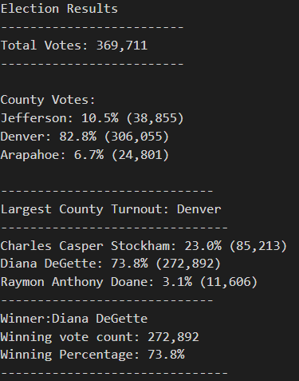

# Election Analysis
## Overview, Asynchronous module:
The colorado board of elections employee has given you the following tasks to complete the election audit of the recent local congressional election.  
1. Calculate the total number of votes cast.
2. Get a complete list of candidates who received votes.
3. Calculate the totla number of votes each candidate received.
4. Calculate the percentage of votes each candidate won.
5. Determine the winner of the election based on popular vote.

## Resources
- Data Source: election_results.csv
- Software: Python 3.7.9, VS Code 1.60.0

## Summary
The analysis of the elections show that
- There were **369,711** votes cast in the election.
- The candidates were
  - Charles Casper Stockham
  - Diana DeGette
  - Raymon Anthony Doane
- The candidate results were
  - **Charles Casper Stockham** received **23.0%** of the vote and **85,213** number of votes.
  - **Diana DeGette** received **73.8%** of the vote and **272,892** number of votes.
  - **Raymon Anthony Doane** received **3.1%** of the vote and **11,606** number of votes.
- The winner of the election was
  - **Diana DeGette, who received 73.8% of the vote and 272,892 number of votes.**

## Overview of the Election Audit Challenge
In addition to overall ask of the project which was outlined in the asynchronous module, the challenge was about extracting county information and providing the same to the Election Commission  
1. The voter turnout for each county
2. The percentage of votes from each county out of the total count
3. The county with the highest turnout

## Audit Results:
The candidate results are already outlined in the asynchronous module summary section. Below we can find the new information requested by the election 
- The 3 counties where election took place were
  - Jefferson: 10.5% (38,855)
  - Denver: 82.8% (306,055)
  - Arapahoe: 6.7% (24,801)
- The county results were
  - **Jefferson** county received **10.5%** of the vote and **38,855** number of votes.
  - **Denver** county received **82.8** of the vote and **306,055** number of votes.
  - **Arapahoe** county received **6.7%** of the vote and **24,801** number of votes.
- **Denver, which received 82.8% of the votes was the county with the highest voter turnout of 306,055 voters**  

The snapshot of the results can be found below  
  

### Key learnings through the module and the challenge
1. Opening and wrting files using Python
```python
#opening a file
with open(file_open_path) as election_data:
   file_reader=csv.reader(election_data)
   headers=next(file_reader)
#writing a file
with open(file_write_path,"w") as outfile:
```
2. Leveraging the power of conditionals and loops to extract large amount of data and perform calculations in an automated and quick manner

```python
for candidate_name in candidate_votes:
        votes = candidate_votes[candidate_name]
        vote_percentage=(votes/total_votes)*100
        #print all candidate names, vote count and vote percentage
        candidate_results=(f"{candidate_name}: {vote_percentage:.1f}% ({votes:,})\n")
        print(candidate_results)
        outfile.write(candidate_results)
        #print(f"{candidate_name}: {vote_percentage:.1f}% ({votes:,})" )
        #find the winning candidate and vote count by checking if winning votes is greater than zero
        if (votes>winning_vote_count) and (vote_percentage>winning_vote_percentage):
            winning_vote_percentage=vote_percentage
            winning_vote_count=votes
            winning_candidate=candidate_name
 ```
 
## Summary and future usecases
The script allows us to loop through multiple candidates and assign votes to each candidate to determine the results of a popular vote. This is done quickly and efficeintly and with some minor modifications this code can be used across multiple elections accross the country to ensure election results are **accurate, timely and are tabulated and presented with minimal manual intervention.**

### Use Case 1: Understanding if one county dominates the outcome of the election
The current code only looks at candidates and county outcomes separately, however by combining the two, we will be able to understand
1. If the winning candidate is only winning because of a larger turnout in one county
2. If the lower voter turnout counties are under-represented
For ex. Modifications using AND in conditionals can be made to the below if statement to create a Candidate-County key which will allow us to understand this further
```python
 if candidate_name not in candidate_options and county_name not in county_options:
 ```
 ### Use Case 2: Uncovering election fraud by looking at duplicate ballot IDs
 By adding a unique ballot ID count to the vote count and ensuring that both are the same, will help us prevent election fraud and can be used as an initial step with a Boolean function before running the entire analysis
 
 ### Use Case 3: Adding type of votes cast
Adding an additional column in the source file which captures the type of votes _Early voting, Voting day, Mail-in voting_ will also help us understand how the constituents are want to vote and can help in analysing a trend and ensuring that we improve voter turnout in future elections. 


